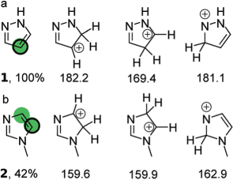
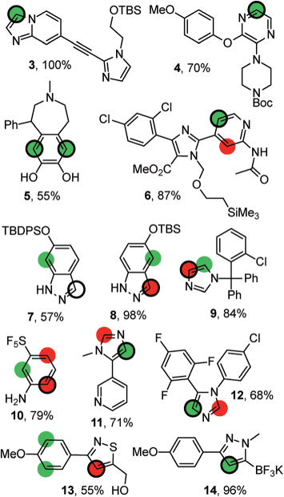
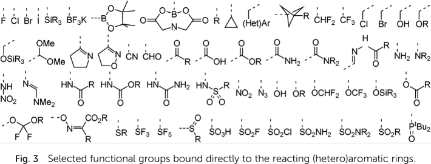

# last edit:  [2026-07-06 Mon]
#+OPTIONS: toc:nil ^:nil

#+LATEX_CLASS:  koma-article
#+LATEX_HEADER: \usepackage{libertine, graphicx, microtype}
#+LATEX_HEADER: \usepackage[scaled=0.75]{beramono}
#+LATEX_HEADER: \usepackage[libertine]{newtxmath}
#+LATEX_HEADER: \usepackage[USenglish]{babel}

* RegioSQM
** Background

   RegioSQM predicts the (hetero)aromatic CH sites most likely
   susceptible to the electrophilic aromatic substitution (EAS).  For
   this, the heat of formation of protonated intermediates is computed
   by MOPAC at the PM3/COSMO level.[fn:COSMO] When testing this
   approach for 535 substrates belonging to 69 groups (e.g., benzenes,
   pyridines, pyridones), the authors observed 96% of the computed
   predictions to match the experimental evidence.  The authors
   maintain a dedicated web site, [[http://regiosqm.org][regiosqm.org]], to perform these
   computations for individual molecules, expressed by a SMILES
   string.[fn:SMILES]

   With the scripts of this repository, RegioSQM may be used locally.
   RegioSQM then may be used for the serial prediction about
   substrates expressed as a list of SMILES strings.  Most of the
   information provided here is based on the seminal [[https://doi.org/10.1039/C7SC04156J][RegioSQM paper]],
   an open access publication.

** Show case

   For a given substrate, RegioSQM probes any (hetero)aromatic
   position /theoretically susceptible/ for an electrophilic
   substitution reaction (EAS) by the addition of hydrogen to yield a
   charged intermediate.  For each position, the heat of formation of
   this intermediate is computed.  As for pyrazole (*1*, line a), for
   example,

   #+ATTR_LATEX:  :width 6cm
   

   protonation in the 4-position yields the least endothermic charged
   regioisomer (169.4 kcal/mol, if computed at the level of
   PM3/COSMO)[fn:COSMO] which RegioSQM indicates by a green dot.  This
   is backed by experimental findings; in the course of an EAS,
   bromine of /N/-bromosuccinimide (NBS) exclusively adds to this
   position.  The illustrations indicate the sites experimentally
   determined as most prominent to the EAS by a black circle.

   The site RegioSQM predicts as most susceptible to the EAS serves as
   a reference.  RegioSQM then compares the heat of formation about
   regioisomers of this reference intermediate.  If the heat of
   formation about the test site's intermediate differs by less than
   1 kcal/mol (4.18 kJ/mol) from the one about the reference site,
   RegioSQM marks the test site equally by a green dot.  The site is
   marked red if the difference with the reference site is more
   1 kcal/mol, but less than 3 kcal/mol (12.6 kJ/mol).  RegioSQM's
   prediction about /N/-methyl imidazole (*2*, line b) is backed by
   experimental evidence; indeed, the EAS with NBS yields a mixture by
   preferential reaction at the two positions highlighted.

   If RegioSQM recognizes a substrate as conformational flexible, by
   default, per site /theoretically susceptible/ to an EAS, the heat
   of formation about up to 20 conformers of the intermediate are
   computed. The prediction then ranks the least endothermic charged
   conformer per site.

   As shown, sometimes, the experimentally observed sites of EAS
   (black circle) are not those RegioSQM predicts as highly
   susceptible (green dot) or moderately susceptible (red dot) to the
   EAS.  Steric hindrance to entrant electrophiles, for example, is
   not considered by RegioSQM's prediction yet may be one plausible
   cause for such a discrepancy.  This however should be balanced with
   the low computational cost of the method deployed (PM3/COSMO
   instead of DFT) to predict rapidly the sites of the EAS reaction.
   Depending on the threshold used, the rate of success within the
   test set of 535 substrates equals to 92% or 96%.

   #+ATTR_LATEX:  :width 6cm
   

   Data in subfolder =replication= permit a replication of this
   prediction for 535 substrates obtained by permutation of 69 mono-
   and bicyclic (hetero)aromatic core structures with the substituents
   like those depicted below:

   #+ATTR_LATEX:  :width 12cm
   

* Proposed deployment

** Local installation

The overall analysis depends on the freely available opensource [[https://openmopac.net/][MOPAC]]
to perform quantum chemical computations.  Its [[https://openmopac.net/download/][download page]] provides
installers for Linux, Mac, and Windows.  You may consult [[https://repology.org/project/mopac/packages][repology.org]]
to check if your distribution provides a package (example
[[https://tracker.debian.org/pkg/mopac][Linux Debian]]), too.

RegioSQM is a collection of Python scripts and modules organized
around a ~pyproject.toml~ file.  Its dependencies ([[https://pypi.org/project/numpy/][NumPy]], [[https://pypi.org/project/rdkit/][RDKit]],
[[https://pypi.org/project/openbabel/][openbabel]]) are most comfortably resolved within a virtual environment.
Thus, check the release page of this repository for a =.whl= of
regioSQM (about 20kB).  If not present, or if the commit history of
the main branch of this repository advanced vs the publication of a
=.whl=, you equally can create a =.whl= on your own, for instance by
either one of

#+begin_src shell :results nil
  python -m build  # see https://pypi.org/project/build/
  uv build  # see https://docs.astral.sh/uv/concepts/projects/build/
#+end_src

with a copy of this GitHub archive.  A third option is to cd into the
decompressed archive (about 23MB) and run a

#+begin_src shell :results nil
  pip install .
#+end_src

In an instance of Linux Debian 14/forky (branch testing with
Python 3.13.14), the size of the supporting virtual environment is
about 285MB.

** Local use

The successful installation of regioSQM provides the =regiosqm=
command to your CLI.  This includes a minimal help menu with prompts
(=regiosqm -h=).

1. preparation of the input file

   Your input file is a list of an alphanumeric identifier of your
   structure of interest followed by a SMILES string.  The two columns
   are whitespace separated.  An example snippet is

   #+begin_src shell :results nil
     benzene c1ccccc1
     pyridine c1ccncc1
     comp402  c1c(n(cc1)C1COC1)C=O
     comp437  c1ccc(o1)Sc1ccccc1
     comp413  c1ccc(s1)/C=N/N=C/c1sccc1
     comp1  n1ccc[nH]1
   #+end_src

   A suggestion is to name this file =input.smi=; however, regioSQM
   does not constrain you on your choice of file name, nor file
   extension.  Programs like [[https://two.avogadro.cc/][Avogadro2]] and [[https://github.com/openbabel/openbabel][OpenBabel]] may help you to
   obtain, or -- by conversion from other files -- assign a SMILES
   string to populate your list.

2. generation of conformers

   Presuming an input file by name of =input.smi=, the command

   #+begin_src shell :results nil
     regiosqm -g input.smi > conformes.csv
   #+end_src

   writes for up to 20 confomers per input SMILES string a MOPAC input
   file (=.mop=).  If wanted, this upper threshold can be adjusted
   (see flag =-c= / =--max_conformations=).

   A typical MOPAC input file generated (here an example about
   benzene) looks like

   #+begin_src shell :results nil
     pm3 charge=1 eps=4.8 cycles=200

     C   1.47640 1  0.40320 1  0.32980 1
     C   0.58630 1  1.35550 1  0.11090 1
     C  -0.79350 1  1.02470 1 -0.19620 1
     C  -1.33460 1 -0.34490 1 -0.29440 1
     C  -0.23540 1 -1.29390 1 -0.02810 1
     C   1.00490 1 -0.97140 1  0.24740 1
     H   2.47770 1  0.69830 1  0.55160 1
     H   0.88480 1  2.39810 1  0.16000 1
     H  -1.47920 1  1.86660 1 -0.36680 1
     H  -1.72440 1 -0.45340 1 -1.33180 1
     H  -2.12910 1 -0.54760 1  0.45240 1
     H  -0.47390 1 -2.36820 1 -0.06310 1
     H   1.74010 1 -1.76710 1  0.42840 1
   #+end_src

   The setup with a dielectric constant of 4.8 corresponds to
   chloroform at a temperature of 20 Celsius[fn:epsilon] (293 K). On
   your own risk you can change the dielectric constant for instance
   to 37.3 (as for nitromethane, a value equally compiled by Alfa
   Chemistry) for instance by

   #+begin_src bash :results nil
     sed -i 's/eps=4\.8/eps=37.3/g' *.mop
   #+end_src

   File =conformers.csv= tracks the sites to be tested for the
   electrophilic substitution for every conformer of every input
   SMILES string provided, e.g.

   #+begin_src shell :results nil
     name, SMILES, reaction_center, len(conformations)
     benzene+_1, C1=C[CH+]CC=C1, 0, 1 , charge=1
     benzene+_2, C1=C[CH+]CC=C1, 5, 1 , charge=1
     benzene+_3, C1=C[CH+]CC=C1, 1, 1 , charge=1
     benzene+_4, C1=C[CH+]CC=C1, 2, 1 , charge=1
     benzene+_5, C1=C[CH+]CC=C1, 3, 1 , charge=1
     benzene+_6, C1=C[CH+]CC=C1, 4, 1 , charge=1
   #+end_src

3. work with MOPAC

   In the overall analysis, especially with larger / more flexible
   molecules and datasets, the computation with MOPAC is the rate
   limiting step.  Thus, it is recommended to parallelize the work
   with the =.mop= files.  With [[https://www.gnu.org/software/parallel/][GNU Parallel]] (entry on [[https://repology.org/project/parallel/packages][repology.org]],
   example package of [[https://tracker.debian.org/pkg/parallel][Linux Debian]]), a command like

   #+begin_src bash :results nil
     ls *.mop | parallel -j4 "mopac {}"
   #+end_src

   runs up to 4 concurrent processes of MOPAC.  Depending on the
   number of CPU cores at your disposition, you may adjust flag =-j=
   to your preference.

   A less efficient sequential run supported by Debian's BASH could be

   #+begin_src bash :results no
     for file in *.mop
     do
         mopac "$file"
     done
   #+end_src

   If you work with Windows with access to [[https://git-scm.com/install/windows][Windows git]] and its Git
   Bash, the functionally equivalent command would be

   #+begin_src shell :results nil
     for file in *.mop; do mopac.exe "$file"; done
   #+end_src

4. analysis of the results

   Back in regioSQM, the call of

   #+begin_src bash :results nil
     regiosqm -a input.smi conformers.csv > results.csv
   #+end_src

   analyzes MOPAC's results.  Per submitted SMILES string, the tally
   reports the predictions about an aromatic electrophilic
   substitution.  In the .svg simultaneously generated, green disks
   highlight the most favorable site(s), red disks somewhat favorable
   site(s).

Note that the result of the prediction may depend on the usage of
MOPAC.  A more obvious reason is the aforementioned change of the
dielectric constant, a less obvious one the release of MOPAC used.

** Extensive check

   Further development of MOPAC and RegioSQM may affect the prediction
   of sites deemed exceptionally susceptible to the EAS reaction.  To
   identify changes since submission of the seminal publication in
   2017, the scrutiny of substrates tested was replicated with
   MOPAC 2016 (version 20.173L, 64-bit).  Tools used and intermediate
   results obtained (e.g., SMILES strings / illustrated atom indices
   per EAS class) as obtained with release 2.0.0-beta are provided in
   folder =replication=.  Especially the results in sub-folder
   =predicted_sites= allow a quick comparison of a current and of
   future local installations of RegioSQM a rapid diffview of texts.

   In comparison of the results depicted in the SI of the seminal
   paper, only 47 out of 535 pattern (8.8%) reexamined changed since
   them.  Among these, changes for the definitively better
   (22 pattern, about 4.1%) or definitively worse (22) are scattered
   over multiple EAS classes.  For 2 pattern (about 0.4%), no
   attribution for the better or worse was made.

* Footnotes

[fn:COSMO] MOPAC's use of COSMO, the «COnductor-like Screening MOdel»
by Klamt and Schüümann is described in MOPAC's [[https://openmopac.net/Manual/cosmo.html][manual]].  By default,
computations by RegioSQM are performed with MOPAC's implicit effective
van der Waals radius of the solvent of 1.3 \AA and an explicitly
defined dielectric constant of 4.8 (chloroform, see module
=molecule_formats.py=, line 62).

[fn:SMILES] If your molecule sketcher of choice does not offer the
export into this format, consider [[http://openbabel.org/wiki/Main_Page][OpenBabel]] for a (batch) conversion
of your structure files into this format, or copy-paste the strings
provided by a service like the [[https://pubchem.ncbi.nlm.nih.gov/edit3/index.html][PubChem Sketcher]].

[fn:epsilon] For a compilation of dielectric constants, see for
instance the compilation on
https://www.alfa-chemistry.com/resources/table-of-dielectric-constants-of-liquids.html
